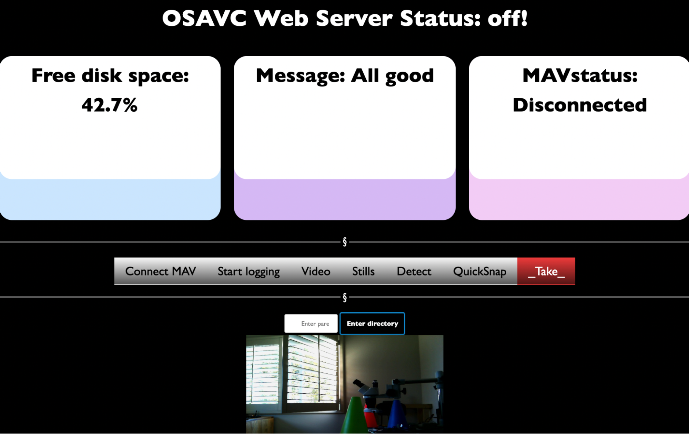
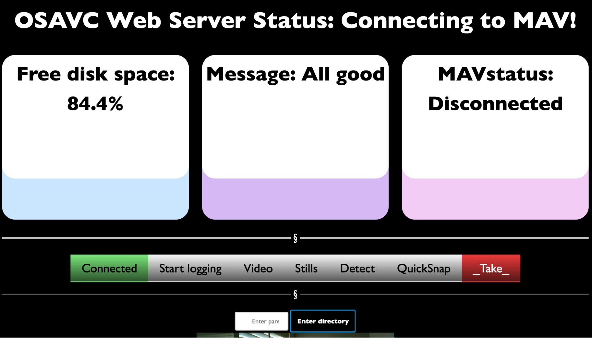

# Companion Computers

## Hardware

Required materials

- Raspberry Pi
  - Rpi 4 Model B 8GB RAM
  - Power supply: Raspberry Pi 15W USB-C Power Supply
- PC with microSD card slot
- MicroSD card
  - SanDisk 64GB Ultra MicroSDXC


## Software

- Install the Raspberry Pi Imager [here.](https://www.raspberrypi.com/software/)

- Install the VNC Viewer [here.](https://www.realvnc.com/en/connect/download/viewer/)

## Imaging in Headless Mode

- Insert the microSD card into the PC
- Open the Raspberry Pi Imager
  - Select the Raspberry Pi OS (64-bit) as the Operating System
  - Select the microSD card as the Storage


- Click on the gear icon in the bottom right hand corner to access the Advanced options
  - Select Set hostname: raspberrypi.local
  - Select Enable SSH and Use password authentication
  - Select Set username and password
    - Type the username and password of your choice
  - Select Configure wireless LAN
    - Type your wifi network name as the SSID and your wifi network password as the Password
    - Find your country’s two-letter country code
  - Click Save


- Now, Click Write

## OSAVC

- Connect the OSAVC and PICkit3 Debugger to your PC
- Load TestHarness.X’s code onto the OSAVC
  - Open the TestHarness.X folder
  - Click Make and Program Device 

## Raspberry Pi 4

- Insert the microSD card into the Raspberry Pi 4
- Connect the micro-USB port of the OSAVC to the USB port of the Raspberry Pi 4
- Power the Raspberry Pi 4 using the USB-C port with the power supply
- Open an SSH tunnel from your PC to the Raspberry Pi 4 by typing ssh [username]@[hostname].local in your PC terminal

```sh
   sudo raspi-config
```
  
- Select 5 Interfacing Options
- Select P3 VNC
- Click Yes to enabling the VNC server
- Save your changes
- Open VNC Viewer and connect to [hostname].local at the top


- Install opencv and its dependencies

```bash
sudo apt-get update
sudo apt install python3-opencv
```

- Install pymavlink

```bash
sudo pip3 install pymavlink
```

- Install a serial terminal on the Raspberry Pi 4

```bash
sudo apt-get install minicom
minicom -b 115200 -o -D /dev/ttyUSB0
```

- Press Ctrl-A Z to get the Mincom Command Summary dialog


- Press o to Configure Minicom
- Select Serial port setup


- press F to set F - Hardware Flow Control : No


- Save by pressing Enter and exit the Minicom Command Summary
- Click on the OSAVC’s reset button
- Press h to transmit a Mavlink heartbeat message from the OSAVC to the Raspberry Pi 4 and then press Enter


- Create a new terminal tab, delete the Minicom terminal tab
- In the new terminal, enter

```bash
git clone https://github.com/uccross/open-source-autonomous-vehicle-controller.git
cd open-source-autonomous-vehicle-controller/companion-computer
git clone -b dev_raspi https://github.com/25ChilingH/PositioningSystem
cd Positioning System/yolov5
pip3 install -r requirements.txt
```

- Follow the Linux installation directions [here](https://coral.ai/docs/accelerator/get-started/)

```bash
python3 OSAVC_web_server_rpi.py
```

- Open http://0.0.0.0:80/ in Chromium by right clicking the link and clicking Open URL.


- A webpage like this should appear



- Click the Connect Mav button
  - The button should turn red
  - The terminal should output target_system 1, target component 0




- Finally, click the Connected button again, and the MAVstatus should become Connected


